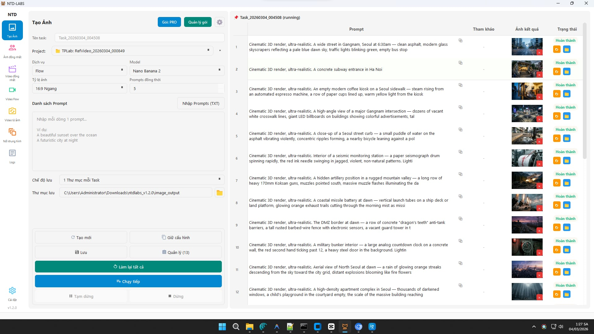
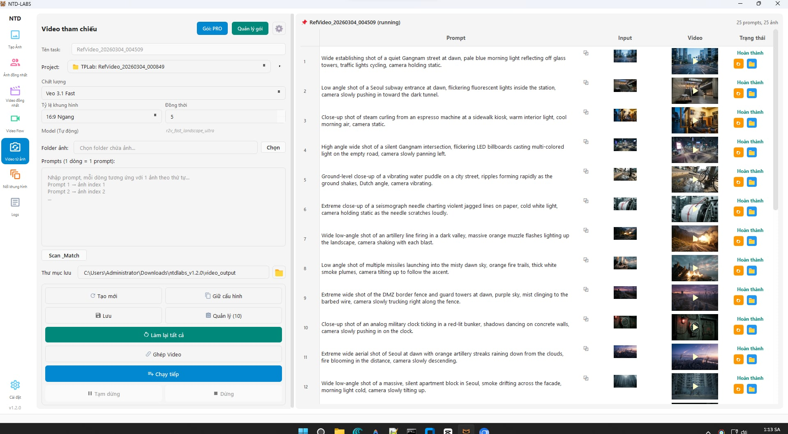

  

<h1 align="center">NTD-LABS</h1>

<strong>Nuôi Tôi Đi Labs</strong> — Tự động hóa AI, đơn giản thôi.

  
  
  
  

  <a href="https://github.com/truongqv12/ntd-labs/releases"><strong>Tải ngay — Miễn phí</strong></a>
  &nbsp;&bull;&nbsp;
  <a href="https://github.com/truongqv12/ntd-labs/issues">Báo lỗi</a>

---

## NTD-LABS là gì?

**NTD-LABS** là phần mềm Windows tự động tạo ảnh và video AI hàng loạt trên Google Labs — quản lý đa tài khoản, nhất quán nhân vật, ghép video FFmpeg, chạy nền không cần giám sát, không cần biết code.

> Nuôi mèo xong rồi thì nuôi luôn content pipeline đi. Để NTD-LABS lo.

*NTD-LABS is a Windows desktop app that automates AI image & video generation on Google Labs — batch processing, multi-account, character-consistent, FFmpeg video concat, no coding required.*

<!-- TODO: Thêm demo GIF ở đây -->
<!--  -->

---

## Tính năng

### Tạo ảnh AI

- **Tạo ảnh hàng loạt** — nhập danh sách prompt, app tự chạy, bạn đi làm việc khác
- **Hai dịch vụ** — Whisk + Flow, tối đa output
- **Ảnh đồng nhất nhân vật** — dùng cú pháp `@tên` để giữ khuôn mặt/phong cách nhất quán
- **Upload thông minh** — ảnh tham chiếu chỉ upload 1 lần mỗi task

### Tạo video AI

- **4 chế độ tạo video** — text-to-video, ảnh tham chiếu, ảnh khởi đầu, khung hình nối tiếp
- **Video khung hình nối tiếp** — quét thư mục, ghép cặp ảnh, tạo video tự động qua bảng mapping
- **Ghép video** — gộp nhiều clip bằng FFmpeg tích hợp, hỗ trợ video xoay ngang/dọc
- **Model mới nhất** — tự động cập nhật model video từ Google Labs (cache 24h)
- **Nâng cấp video (Upscale)** — nâng chất lượng video lên 1080p hoặc 4K

### Tự động hóa & Quản lý

- **Đa tài khoản** — chạy nhiều tài khoản Google Labs song song
- **Chọn project xuyên trang** — chọn Flow project 1 lần, dùng mọi nơi
- **Tự làm mới phiên** — session hết hạn tự refresh khi mở app
- **Giới hạn thông minh** — tự động điều chỉnh theo gói đăng ký
- **Quản lý task** — đặt tên, lọc theo loại trang, xóa task kèm dọn thư mục output
- **Chỉnh sửa & thử lại prompt** — sửa prompt trực tiếp, retry từng prompt riêng lẻ
- **Giao diện sáng & tối** — chuyển đổi tùy thích

---

## 6 trang tạo nội dung

| Trang | Đầu vào | Đầu ra | Phù hợp cho |
|-------|---------|--------|-------------|
| **Tạo Ảnh** | Prompt văn bản | Ảnh AI hàng loạt | Sản xuất content số lượng lớn |
| **Ảnh đồng nhất** | Prompt + ảnh `@tên` | Ảnh nhất quán nhân vật | Series, avatar, brand character |
| **Tạo Video** | Prompt văn bản | Video AI | Short-form, quảng cáo |
| **Video tham chiếu** | Ảnh + prompt | Video từ ảnh mẫu | Demo sản phẩm, storytelling |
| **Video đồng nhất** | Ảnh nhân vật + prompt | Video nhất quán nhân vật | Series nhân vật cố định |
| **Khung hình nối tiếp** | Cặp ảnh + prompt | Video nối khung hình | Chuyển cảnh mượt, animation |

---

## Bắt đầu nhanh

**3 bước. Chạy trong 5 phút.**

### 1. Tải về

Vào [Releases](https://github.com/truongqv12/ntd-labs/releases), tải file `.zip` mới nhất.

### 2. Giải nén

Giải nén vào bất kỳ đâu trên máy Windows. Không cần cài đặt.

### 3. Chạy

Mở `NTD-LABS.exe` → Đăng nhập Google hoặc nhập license key → Bắt đầu tạo.

  <a href="https://github.com/truongqv12/ntd-labs/releases"><strong>Tải NTD-LABS v1.3.0</strong></a>

---

## Yêu cầu hệ thống

| Thành phần | Yêu cầu |
|-----------|---------|
| Hệ điều hành | Windows 10 / 11 (64-bit) |
| RAM | Tối thiểu 4 GB, khuyến nghị 8 GB |
| Ổ cứng | ~1.5 GB trống |
| Internet | Bắt buộc (truy cập Google Labs) |
| Tài khoản Google | Bắt buộc (miễn phí) |

---

## Bảng giá

Dùng miễn phí. Nâng cấp khi bạn sẵn sàng.

| Tính năng | Free | Lite | Pro |
|-----------|:----:|:----:|:---:|
| Tạo Ảnh | ✅ | ✅ | ✅ |
| Tạo Video | ✅ | ✅ | ✅ |
| Ảnh đồng nhất nhân vật | ✅ | ✅ | ✅ |
| Video tham chiếu | ✅ | ✅ | ✅ |
| Video đồng nhất nhân vật | — | ✅ | ✅ |
| Nâng cấp video (1080p/4K) | — | ✅ | ✅ |
| Prompt mỗi task | 50 | 1,000 | Không giới hạn |
| Task đồng thời | 1 | 3 | 5 |
| Tài khoản | 3 | 1 | 5 |
| **Giá** | **Miễn phí** | **Có phí** | **Có phí** |

> Chi tiết giá xem trên website. Thanh toán QR qua SePay — kích hoạt tức thì, ngay trong app.

---

## Ảnh chụp màn hình

### Tạo Ảnh — Batch AI Image Generation

### Video Tham Chiếu — Image-to-Video Batch Processing

<!-- TODO: Thêm ảnh khi có -->
<!--  -->
<!--  -->

---

## Câu hỏi thường gặp

<strong>Có thật sự miễn phí không?</strong>

Có. Gói Free bao gồm Tạo Ảnh, Tạo Video, Ảnh đồng nhất và Video tham chiếu — không giới hạn thời gian. Gói Lite/Pro mở thêm Video đồng nhất, Nâng cấp video 1080p/4K, tăng prompt mỗi task và số task đồng thời.

<strong>App có an toàn không?</strong>

NTD-LABS chỉ giao tiếp với Google Labs và API membership của chúng tôi. Không có dữ liệu nào rời khỏi máy bạn ngoài các yêu cầu tạo nội dung. Thông tin đăng nhập Google không được lưu trữ — xác thực qua OAuth token flow chuẩn.

<strong>Tài khoản Google có bị khóa không?</strong>

NTD-LABS được thiết kế để sử dụng có trách nhiệm trong workflow của Google Labs. Chúng tôi khuyến nghị dùng tài khoản riêng cho workload nặng và tuân thủ chính sách sử dụng của Google.

<strong>Tại sao không mã nguồn mở?</strong>

NTD-LABS là sản phẩm thương mại. Giữ mã nguồn đóng giúp chúng tôi đầu tư phát triển, duy trì hệ thống membership, và ship cập nhật nhanh hơn. App được phân phối dạng file chạy độc lập — không cần cài đặt gì thêm.

<strong>Có hỗ trợ macOS hoặc Linux không?</strong>

Hiện tại chưa. NTD-LABS chỉ chạy trên Windows. macOS/Linux chưa có trong lộ trình.

<strong>Tìm thấy lỗi thì báo ở đâu?</strong>

Mở issue trên [trang Issues](https://github.com/truongqv12/ntd-labs/issues). Ghi rõ phiên bản Windows, phiên bản app (xem trong dialog About), và các bước tái hiện lỗi.

---

  
   
  <strong>NTD-LABS</strong> — Nuôi Tôi Đi Labs
   

