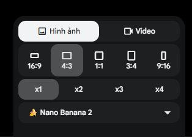
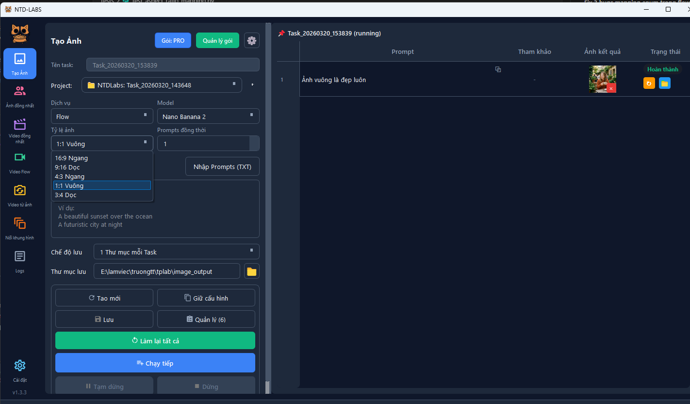

<p align="center">
  
</p>

<h1 align="center">NTD-LABS</h1>
<p align="center"><strong>Phần mềm Windows tạo ảnh và video AI hàng loạt trên Google Labs.</strong></p>

<p align="center">
  
  
  
  
</p>

<p align="center">
  <a href="https://github.com/truongqv12/ntd-labs/releases/latest"><strong>Tải bản .zip mới nhất</strong></a>
  &nbsp;&bull;&nbsp;
  <a href="https://github.com/truongqv12/ntd-labs/issues">Báo lỗi</a>
</p>

---

## Tải bản build `.zip` cho khách hàng

Nếu bạn chỉ muốn tải và dùng ngay, hãy làm đúng 3 bước này:

**Bản ứng dụng public hiện tại:** `v1.3.6`

### 1. Vào trang tải chính thức

Truy cập: [GitHub Releases](https://github.com/truongqv12/ntd-labs/releases/latest)

### 2. Tải đúng file `.zip`

Trong danh sách file phát hành, hãy tải file có tên dạng:

```text
ntdlabs-bootstrap-<version>.zip
```

Ví dụ bản public hiện tại:

```text
ntdlabs-bootstrap-1.0.1.zip
```

> Khách hàng không cần tải riêng `core` hoặc `runtime`. Chỉ cần file `bootstrap .zip`.
>
> `ntdlabs-bootstrap-1.0.1.zip` là file launcher để cài/chạy nhanh. Bản ứng dụng hiện tại mà khách hàng sẽ dùng là `v1.3.6`.

### 3. Giải nén và chạy

- Giải nén file `.zip`
- Mở `NTDLabsLauncher.exe`
- Ở lần chạy đầu tiên, launcher sẽ tự tải các thành phần cần thiết
- Sau đó ứng dụng sẽ mở để bạn đăng nhập và bắt đầu sử dụng

---

## NTD-LABS là gì?

**NTD-LABS** là ứng dụng desktop cho Windows giúp bạn tự động hóa quy trình tạo ảnh và video AI trên Google Labs. Phù hợp cho cá nhân làm content, team social, shop online, agency, và bất kỳ ai muốn tạo nội dung nhanh hơn mà không cần thao tác thủ công lặp đi lặp lại.

Bạn có thể:

- tạo ảnh AI hàng loạt từ danh sách prompt
- giữ nhân vật nhất quán bằng cú pháp `@tên`
- tạo video từ text, ảnh tham chiếu, ảnh đầu vào, hoặc cặp khung hình
- ghép video bằng FFmpeg tích hợp
- nâng cấp video lên 1080p hoặc 4K
- quản lý nhiều tài khoản, nhiều task, nhiều project trong một nơi

---

## Điểm nổi bật

### Tạo ảnh AI

- Chạy hàng loạt nhiều prompt trong một task
- Hỗ trợ cả Whisk và Flow
- 5 tỷ lệ ảnh cho Flow: `16:9`, `9:16`, `4:3`, `1:1`, `3:4`
- Tạo ảnh nhân vật đồng nhất với cú pháp `@tên`
- Ảnh tham chiếu chỉ cần upload 1 lần cho mỗi task

### Tạo video AI

- 4 chế độ tạo video
- Video từ ảnh tham chiếu
- Video khung hình nối tiếp
- Ghép nhiều clip thành một video hoàn chỉnh
- Upscale video lên 1080p hoặc 4K

### Quản lý và vận hành

- Quản lý đa tài khoản Google Labs
- Tự làm mới phiên khi mở app
- Chọn project dùng xuyên các trang
- Quản lý task rõ ràng, có lọc, có đặt tên, có dọn thư mục output
- Giao diện tối ưu cho người không biết code

---

## Dành cho ai?

NTD-LABS phù hợp nếu bạn đang cần:

- làm content hàng ngày nhanh hơn
- tạo ảnh và video số lượng lớn
- giữ nhân vật hoặc style nhất quán giữa nhiều prompt
- giảm thao tác tay khi chạy nhiều tài khoản
- có một app Windows gọn để dùng thay vì tự viết script

---

## 6 trang tạo nội dung

| Trang | Đầu vào | Đầu ra | Phù hợp cho |
| --- | --- | --- | --- |
| **Tạo Ảnh** | Prompt văn bản | Ảnh AI hàng loạt | Content số lượng lớn |
| **Ảnh đồng nhất** | Prompt + ảnh `@tên` | Ảnh nhân vật đồng nhất | Series nhân vật, mascot, avatar |
| **Tạo Video** | Prompt văn bản | Video AI | Video ngắn, quảng cáo, demo |
| **Video tham chiếu** | Ảnh + prompt | Video từ ảnh mẫu | Storytelling, trình diễn sản phẩm |
| **Video đồng nhất** | Ảnh nhân vật + prompt | Video nhân vật đồng nhất | Series nhân vật cố định |
| **Khung hình nối tiếp** | Cặp ảnh + prompt | Video chuyển cảnh | Animation, before-after, nối chuyển động |

---

## Bắt đầu nhanh

### Cách 1: Dành cho khách hàng chỉ muốn dùng app

1. Tải file `ntdlabs-bootstrap-*.zip` từ [Releases](https://github.com/truongqv12/ntd-labs/releases/latest)
2. Giải nén ra một thư mục bất kỳ trên Windows
3. Mở `NTDLabsLauncher.exe`
4. Đợi launcher chuẩn bị ứng dụng
5. Đăng nhập Google hoặc nhập license key để bắt đầu

### Cách 2: Muốn luôn vào đúng trang tải

<p align="center">
  <a href="https://github.com/truongqv12/ntd-labs/releases/latest"><strong>Tải NTD-LABS v1.3.6</strong></a>
</p>

---

## Yêu cầu hệ thống

| Thành phần | Yêu cầu |
| --- | --- |
| Hệ điều hành | Windows 10 / 11 (64-bit) |
| RAM | Tối thiểu 4 GB, khuyến nghị 8 GB |
| Ổ cứng trống | Khoảng 1.5 GB |
| Internet | Bắt buộc ở lần chạy đầu và khi dùng Google Labs |
| Tài khoản | Cần tài khoản Google để chạy workflow |

---

## Bảng giá

Dùng miễn phí để trải nghiệm. Nâng cấp khi cần thêm giới hạn và tính năng.

| Tính năng | Free | Lite | Pro |
| --- | :---: | :---: | :---: |
| Tạo ảnh | ✅ | ✅ | ✅ |
| Tạo video | ✅ | ✅ | ✅ |
| Ảnh đồng nhất nhân vật | ✅ | ✅ | ✅ |
| Video tham chiếu | ✅ | ✅ | ✅ |
| Video đồng nhất nhân vật | — | ✅ | ✅ |
| Upscale video 1080p/4K | — | ✅ | ✅ |
| Prompt mỗi task | 50 | 1,000 | Không giới hạn |
| Task đồng thời | 1 | 3 | 5 |
| Tài khoản | 3 | 1 | 5 |
| Giá | Miễn phí | Có phí | Có phí |

> Thanh toán bằng QR qua SePay, kích hoạt ngay trong ứng dụng.

---

## Ảnh chụp màn hình

### Tạo ảnh hàng loạt


### Chọn tỷ lệ ảnh



### Flow hỗ trợ nhiều khung hình



### Video tham chiếu


---

## Câu hỏi thường gặp

<details>
<summary><strong>Tôi phải tải file nào trong Releases?</strong></summary>

Hãy tải file `ntdlabs-bootstrap-*.zip`. Đây là bản dành cho khách hàng. Bạn không cần tải riêng `core` hay `runtime`.

</details>

<details>
<summary><strong>Sau khi tải .zip thì mở file nào?</strong></summary>

Giải nén xong, mở `NTDLabsLauncher.exe`. Launcher sẽ tự chuẩn bị ứng dụng cho bạn ở lần chạy đầu tiên.

</details>

<details>
<summary><strong>Có cần cài đặt không?</strong></summary>

Không cần cài theo kiểu installer truyền thống. Bạn chỉ cần giải nén file `.zip` rồi chạy launcher.

</details>

<details>
<summary><strong>Dùng miễn phí thật không?</strong></summary>

Có. Bản Free cho phép trải nghiệm các workflow chính. Các gói trả phí mở rộng giới hạn và thêm tính năng nâng cao.

</details>

<details>
<summary><strong>Windows hiện cảnh báo khi mở file thì sao?</strong></summary>

Nếu Windows SmartScreen hiện cảnh báo, hãy kiểm tra đúng là bạn tải file từ repo chính thức này rồi chọn mở tiếp nếu bạn tin cậy nguồn tải.

</details>

<details>
<summary><strong>Ứng dụng có hỗ trợ macOS hoặc Linux không?</strong></summary>

Hiện tại chưa. NTD-LABS đang phát hành cho Windows.

</details>

<details>
<summary><strong>Tìm thấy lỗi thì báo ở đâu?</strong></summary>

Bạn có thể báo tại [Issues](https://github.com/truongqv12/ntd-labs/issues). Nên kèm phiên bản app, Windows, và các bước để tái hiện lỗi.

</details>

---

<p align="center">
  
  <br>
  <strong>NTD-LABS</strong>
  <br>
  Tạo ảnh và video AI hàng loạt trên Windows, gọn và dễ dùng.
</p>
